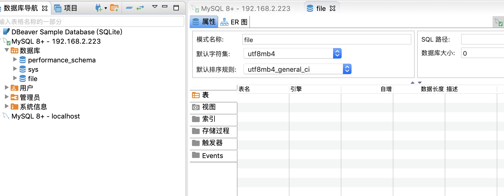

# mysql
## 安装

`sudo apt-get install mysql-server-5.7  `

`sudo vim /etc/mysql/debian.cnf  `

默认账号密码如下

```conf
# Automatically generated for Debian scripts. DO NOT TOUCH!
[client]
host     = localhost
user     = debian-sys-maint
password = YAkAW5mKgsojv6uD
socket   = /var/run/mysqld/mysqld.sock
[mysql_upgrade]
host     = localhost
user     = debian-sys-maint
password = YAkAW5mKgsojv6uD
socket   = /var/run/mysqld/mysqld.sock
~                                            
```

`mysql -u debian-sys-maint -p           `

- 修改密码

  ```sql
  use mysql;
  
  update user set authentication_string=password("root") where user="root";  
  flush privileges;              
  ```

- 重启

  `sudo service mysql restart`          

## 配置

```
update mysql.user set authentication_string=password('root') where user='root'

grant all privileges on *.* to 'root'@'%' identified by '这里替换成你的密码' with grant option;

update user set host='%' where user='root' and host='localhost';

flush privileges;
```

`sudo vim /etc/mysql/mysql.conf.d/mysqld.cnf`

```
# 添加配置
#
user            = mysql
pid-file        = /var/run/mysqld/mysqld.pid
socket          = /var/run/mysqld/mysqld.sock
port            = 3306
basedir         = /usr
datadir         = /var/lib/mysql
tmpdir          = /tmp
lc-messages-dir = /usr/share/mysql
skip-external-locking
skip-grant-tables
#
# Instead of skip-networking the default is now to listen only on
# localhost which is more compatible and is not less secure.
# 关闭 127.0.0.1 访问
# bind-address          = 127.0.0.1    
# 重启
sudo service mysql restart
```



连接成功