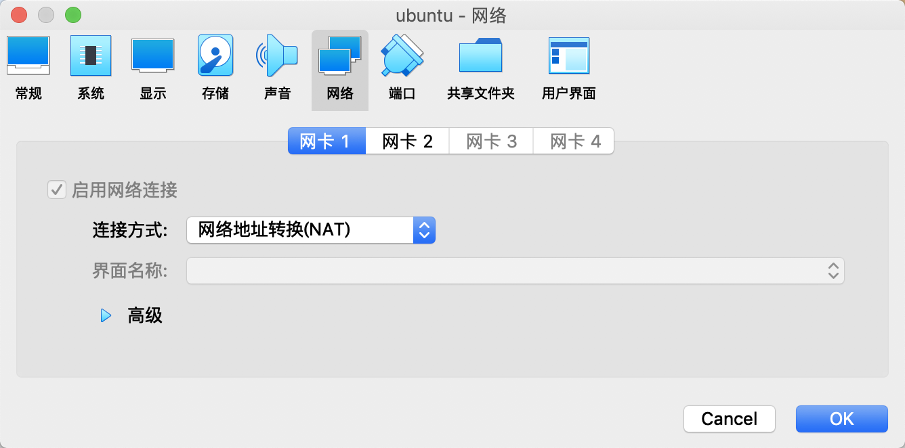
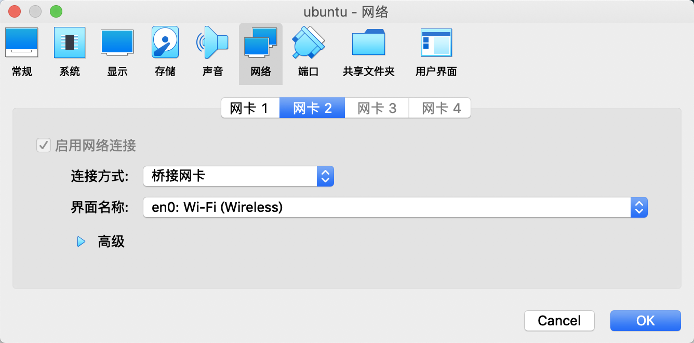
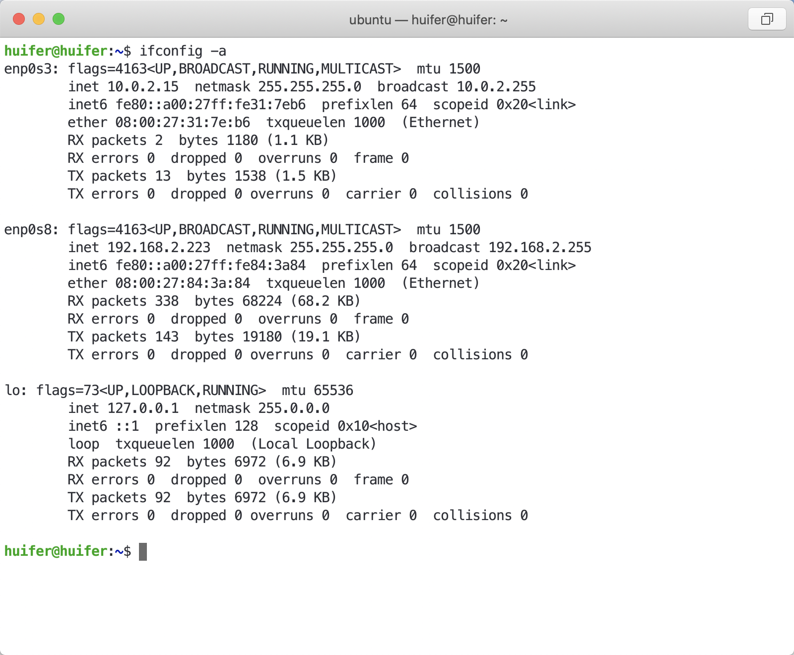

# ubuntu 

虚拟机配置两个网卡,网卡1用来访问外网,网卡2用来访问本地

 







Ubutnu 18 修改ip

`sudo vim /etc/netplan/50-cloud-init.yaml    `

```yml
network:
    ethernets:
        enp0s3:
            dhcp4: true
        enp0s8:
            dhcp4: no
            addresses: [192.168.2.223/24,]
            gateway4: 192.168.2.1
    version: 2
```


`sudo netplan apply` 生效