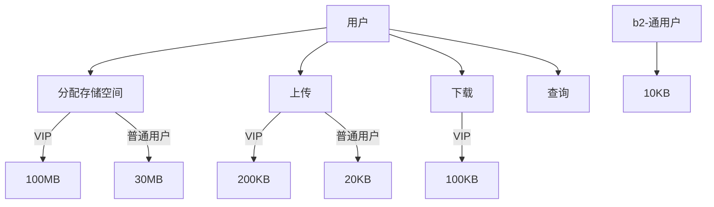

# Happy-Java

快乐的java项目

## 目标
- 实现类似百度网盘的功能
    - 用户
       - 普通用户
       - vip用户
   - 文件
        - 分布式文件存储
        - 断点续传
        - 文件搜索
        - 下载限流
        


```sequence
用户-> 用户系统 : 登录
用户-> 文件系统: 上传下载查询
用户-> VIP系统: 开通VIP
VIP系统-->通知系统: 通知管理员有人开启VIP
文件系统--> 通知系统: 通知用户操作完成


```


权限表

| 字段名称  | 含义     | 类型                                  |
| --------- | -------- | ------------------------------------- |
| id        | 主键     | bigint                                |
| role_name | 权限名称 | varchar                               |
| role_id   | 权限id   | tinyint(0超级管理员,1普通用户,2VIP用户) |


用户表

| 字段名称  | 含义     | 类型                                  |
| -------- | ---- | ---- |
| id       |      |      |
| email    |      |      |
| username |      |      |
| password |      |      |
| salt     |      |      |
| role_id  |      |      |


文件信息表

| 字段名称  | 含义     | 类型     |
| ---------- | ----------- | ---- |
| fileid     | 文件id 唯一 |      |
| filename   | 文件名称    |      |
| size       | 文件大小    |      |
| burst_size | 分片数      |      |
| user_id    | 用户id      |      |


文件关联表

| 字段名称  | 含义     | 类型                                  |
| -------- | ---------------------------------------------- | ---- |
| id       | 自增长列                                       |      |
| filename | 文件名称,从文件信息表过来                      |      |
| burst_id | 分片id, 相同文件名+burst_id 组合后成为一个文件 |      |
| url      | 文件地址                                       |      |

